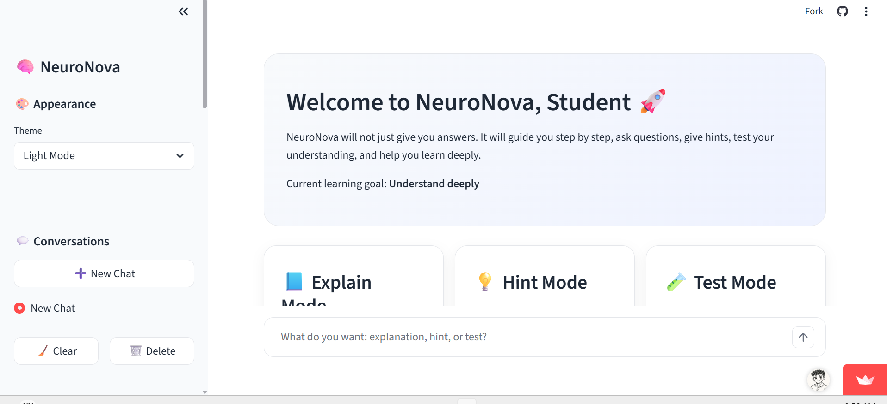
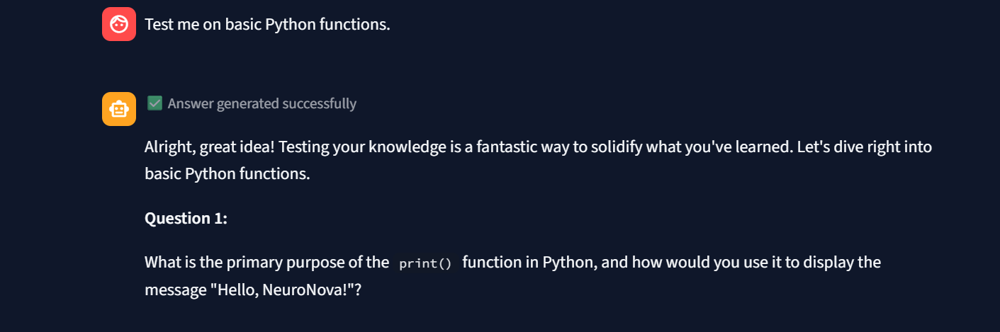
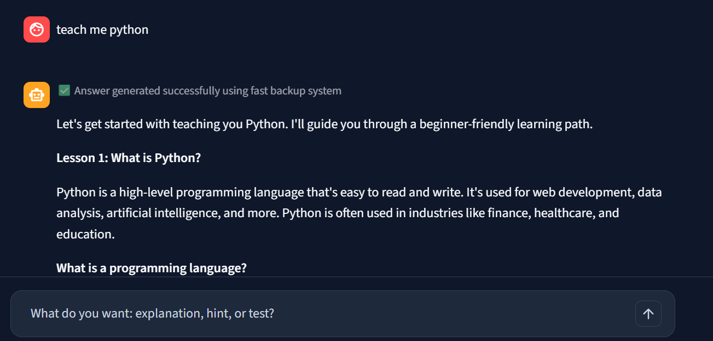
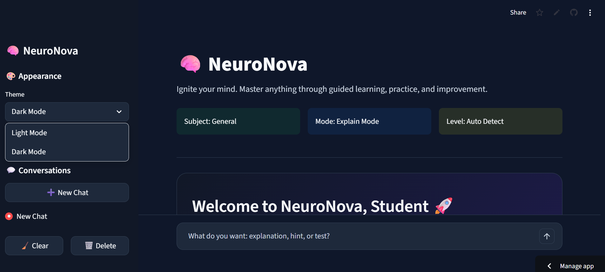

# 🧠 NeuroNova

**NeuroNova** is a SaaS-style AI learning platform prototype designed to help students learn deeply through guided explanations, hints, quizzes, challenges, Python lessons, multilingual support, and AI-powered study assistance.

Unlike a normal chatbot that only gives direct answers, NeuroNova behaves like a smart academic tutor. It guides students step by step, checks understanding, corrects mistakes, and helps learners improve continuously.

---

## 🚀 Live Demo

🔗 Try NeuroNova here:  
[https://YOUR-STREAMLIT-APP-LINK.streamlit.a](https://neuronova-ai-learning-platform.streamlit.app/)pp

---

## 📸 Screenshots

### Home / Welcome Screen

### Multiple Conversations Sidebar

### Python Learning Path

### Light / Dark Mode

---

## ✨ Features

- 🧠 Guided AI tutoring
- 💬 ChatGPT-style multiple conversations
- 🌗 Light / Dark mode
- 🐍 Python learning path
- 🧪 Test Mode with answer verification
- 🌍 Chinese / English bilingual explanations
- 📚 Wikipedia-powered research context
- ⚡ Multi-provider AI system
- 📥 Export chat history
- 🎨 Custom NeuroNova branding

---

## 🧠 Learning Modes

NeuroNova supports:

- Explain Mode
- Hint Mode
- Test Mode
- Challenge Mode
- Project Mode
- Research Mode
- Fast Answer Mode
- Qwen Mode

---

## 🛠️ Tech Stack

- Python
- Streamlit
- Gemini API
- Groq API
- OpenRouter API
- Qwen via OpenRouter
- Wikipedia API
- GitHub
- Streamlit Cloud

---

## 🔒 Source Code

The main source code is private because NeuroNova is planned as a future SaaS learning platform.

This public repository is a showcase version containing only:

- Project description
- Screenshots
- Live demo link
- Feature overview

---

## 📌 Project Status

**Version:** NeuroNova v1.0 Prototype  
**Status:** Public demo available  
**Type:** AI learning platform / student portfolio project  

---

## 🛣️ Future Roadmap

- SQLite database for permanent chat history
- User authentication
- Saved study sessions
- File upload for PDFs and notes
- Flashcard generator
- Learning progress dashboard
- Mobile UI improvements
- Full SaaS backend

---

## 👨‍💻 Author

**Hanan Ossama**  
AI student and future AI/software engineer.

GitHub: [DonUserOn](https://github.com/DonUserOn)
